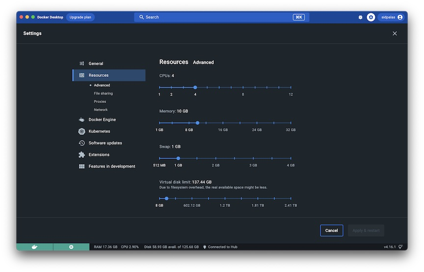

[Home](../README.md) | [History and Motivation](../01-history-and-motivation/README.md)
| [Technology Overview](../02-technology-overview/README.md)
| [Installation and Set Up](../03-installation-and-set-up/README.md)
| [Using 3rd Party Containers](../04-using-3rd-party-containers/README.md)
| [Example Web Application](../05-example-web-application/README.md)
| [Building Container Images](../06-building-container-images/README.md)
| [Container Registries](../07-container-registries/README.md)
| [Running Containers](../08-running-containers/README.md)
| [Container Security](../09-container-security/README.md)


---

# Installation and Set Up

Docker Desktop: https://docs.docker.com/get-docker/

Docker Engine: https://get.docker.com/ 

***Note:*** See [02-technology-overview](../02-technology-overview/README.md) for a description of the difference between Docker Desktop and Docker Engine. If you are installing on your development system, you will most likely want Docker Desktop.

---

## Configuring Docker Desktop

The default settings are likely fine for getting started, but if you begin to run more intensive applications, you may want to adjust the resources available to Docker. This can be done within the settings panel in the GUI.



---

## Running Your First Containers

Hello World:
```
docker run docker/whalesay cowsay "Hey Team! 👋"
```

Run Postgres:
```
docker run \
  --env POSTGRES_PASSWORD=foobarbaz \
  --publish 5432:5432 \
  postgres:15.1-alpine
```
we set up a password here hit password haja obligatory for a container to run , ila makanch maghadich ikhdm 
also we didi publish so we can expos the port hit postgress aykon f wahd isolated container o ila bghina nconnectiw bih we need to expose the port
